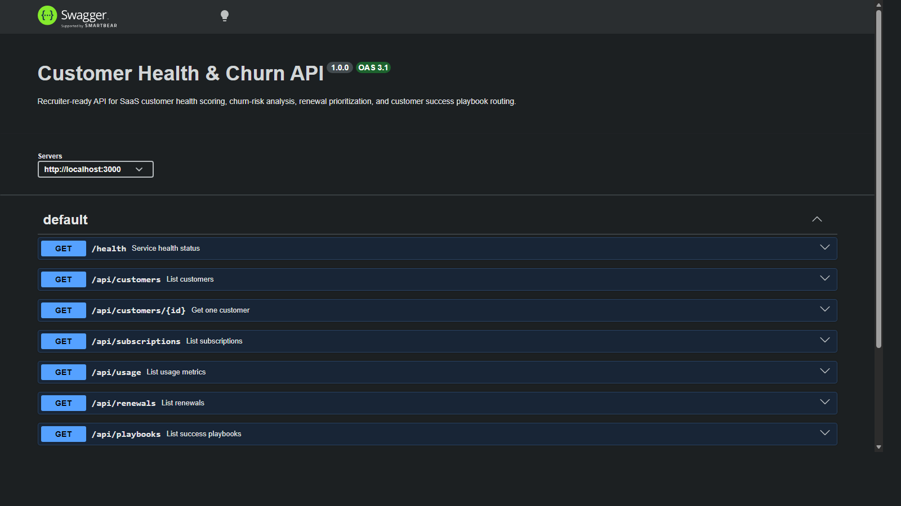
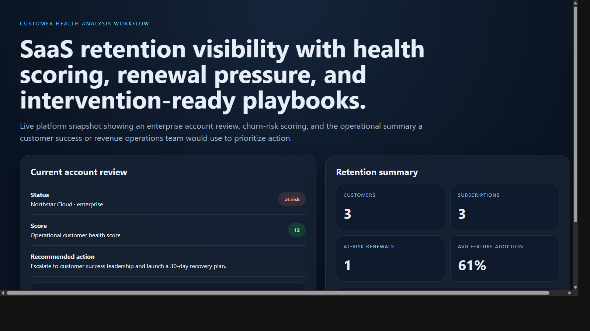
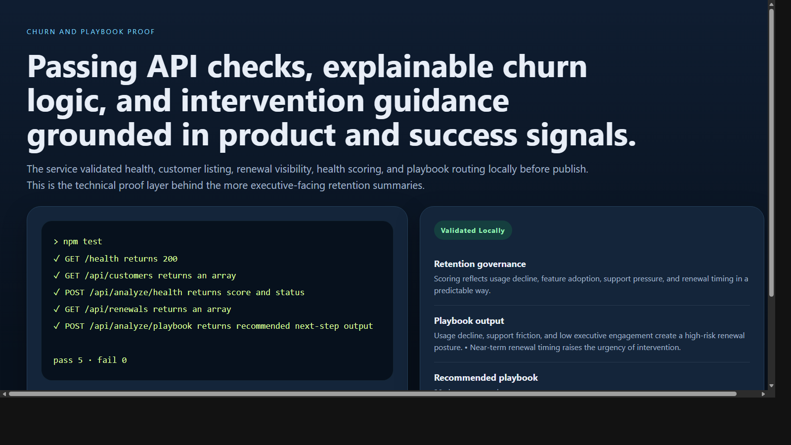

# Customer Health & Churn API

> **TypeScript customer success portfolio project** demonstrating SaaS health scoring, churn-risk analysis, renewal prioritization, and playbook routing across product, support, and revenue signals.

**Recruiter takeaway:** *"This person understands SaaS retention as a practical decisioning system, not just account record storage."*

---

## Project Overview

| Attribute | Detail |
|---|---|
| **Runtime** | Node.js + TypeScript |
| **Framework** | Express 5 |
| **Domain** | SaaS retention, customer health, and churn operations |
| **Signal Areas** | Usage trends · Feature adoption · Support pressure · Renewal timing · Sponsor engagement |
| **Operational Outputs** | Health scores · Churn risk · Success playbooks |
| **Docs** | Swagger UI at `/docs` |

---

## Executive Summary

Customer Health & Churn API models the kind of internal service customer success, product, support, and revenue teams use to identify at-risk accounts before renewals go sideways. Instead of presenting raw account attributes, the API turns usage decline, feature adoption, ticket severity, customer sentiment, and renewal timing into practical health scores and recommended intervention paths.

The result is a recruiter-facing backend project that feels like a realistic retention operations capability rather than a toy CRM or dashboard backend.

---

## Architecture

```text
Customer signal input
    |
    v
POST /api/analyze/*
    |
    +--> Request validation
    +--> Usage and adoption review
    +--> Support and sentiment weighting
    +--> Renewal timing review
    +--> Playbook routing
    |
    v
Operational retention output
    |
    +--> healthy
    +--> watch
    +--> at-risk
```

### Health Scoring Workflow

1. Teams submit a customer health scenario or query modeled customers and renewals.
2. The service validates request shape with Zod.
3. Health scoring logic reviews usage decline, feature adoption, support pressure, NPS, renewal timing, and executive engagement.
4. The service returns a score, issues, passed checks, and a recommended next action.
5. Operators use `/api/dashboard/summary`, `/api/renewals`, and `/api/playbooks` to prioritize intervention work.

---

## Churn and Prioritization Model

### Health Review

The health workflow scores:

- monthly active usage trend
- feature adoption
- critical support ticket load
- customer sentiment
- renewal timing urgency
- executive sponsor engagement

### Playbook Routing

Playbook output prioritizes:

- 30-day recovery plans for deteriorating accounts
- expansion motions for high-adoption strategic accounts
- adoption acceleration for mixed-signal accounts

---

## API Endpoints

| Method | Endpoint | Purpose |
|---|---|---|
| `GET` | `/health` | Service status and uptime |
| `GET` | `/api/customers` | List customers |
| `GET` | `/api/customers/:id` | Fetch one customer |
| `GET` | `/api/subscriptions` | List subscriptions |
| `GET` | `/api/usage` | List usage metrics |
| `GET` | `/api/renewals` | List renewals |
| `GET` | `/api/playbooks` | List success playbooks |
| `GET` | `/api/dashboard/summary` | Retention summary view |
| `POST` | `/api/analyze/health` | Analyze customer health |
| `POST` | `/api/analyze/churn` | Analyze churn risk |
| `POST` | `/api/analyze/playbook` | Route to a success playbook |

---

## Sample Analysis Request

```json
{
  "customerName": "Northstar Cloud",
  "planType": "enterprise",
  "monthlyActiveUsers": 184,
  "previousMonthlyActiveUsers": 241,
  "featureAdoptionRate": 0.46,
  "openCriticalTickets": 2,
  "nps": 21,
  "daysUntilRenewal": 47,
  "executiveEngagement": "low"
}
```

## Sample Analysis Response

```json
{
  "status": "at-risk",
  "score": 12,
  "issues": [
    "Monthly active usage has declined materially.",
    "Feature adoption is below target for this account tier.",
    "Critical support volume increases churn probability near renewal.",
    "Customer sentiment is below the healthy NPS range.",
    "Renewal window is approaching and limits intervention time.",
    "Executive sponsor engagement is low."
  ],
  "passedChecks": [
    "Renewal window is still actionable for intervention.",
    "Account remains on a strategic plan tier."
  ],
  "recommendedNextAction": "Escalate to customer success leadership and launch a 30-day recovery plan."
}
```

---

## Screenshots

### Hero Capture



### Customer Health Analysis Workflow



### Churn and Playbook Proof



---

## Getting Started

### Prerequisites

- Node.js 20+
- npm

### Setup

```bash
git clone https://github.com/mizcausevic-dev/customer-health-churn-api.git
cd customer-health-churn-api
npm install
cp .env.example .env
npm run dev
```

Visit:

- `http://localhost:3000/docs`
- `http://localhost:3000/api/customers`
- `http://localhost:3000/api/dashboard/summary`

### Run Tests

```bash
npm test
```

---

## What This Demonstrates

- customer retention analysis translated into backend service logic
- product, support, and revenue signals combined into a practical health model
- churn prioritization instead of raw account dumps
- customer success workflow thinking
- production-minded TypeScript API structure with docs, tests, and operational summaries

---

## Future Enhancements

- persist account signals in PostgreSQL
- ingest CRM, support, and product telemetry sources
- add cohort-level health trend analysis
- expand expansion-likelihood and contraction modeling
- integrate alerting and owner assignment workflows

---

## Tech Stack

- Node.js
- TypeScript
- Express
- Zod
- Swagger / OpenAPI
- Helmet
- CORS
- Morgan
- Node test runner + Supertest

### Portfolio Links

- [LinkedIn](https://www.linkedin.com/in/mirzacausevic)
- [Skills Page](https://mizcausevic.com/skills/)
- [Medium](https://medium.com/@mizcausevic)
- [GitHub](https://github.com/mizcausevic-dev)

---

*Part of [mizcausevic-dev's GitHub portfolio](https://github.com/mizcausevic-dev) — demonstrating SaaS retention analysis, customer success operations, and production-aware backend decisioning.*
